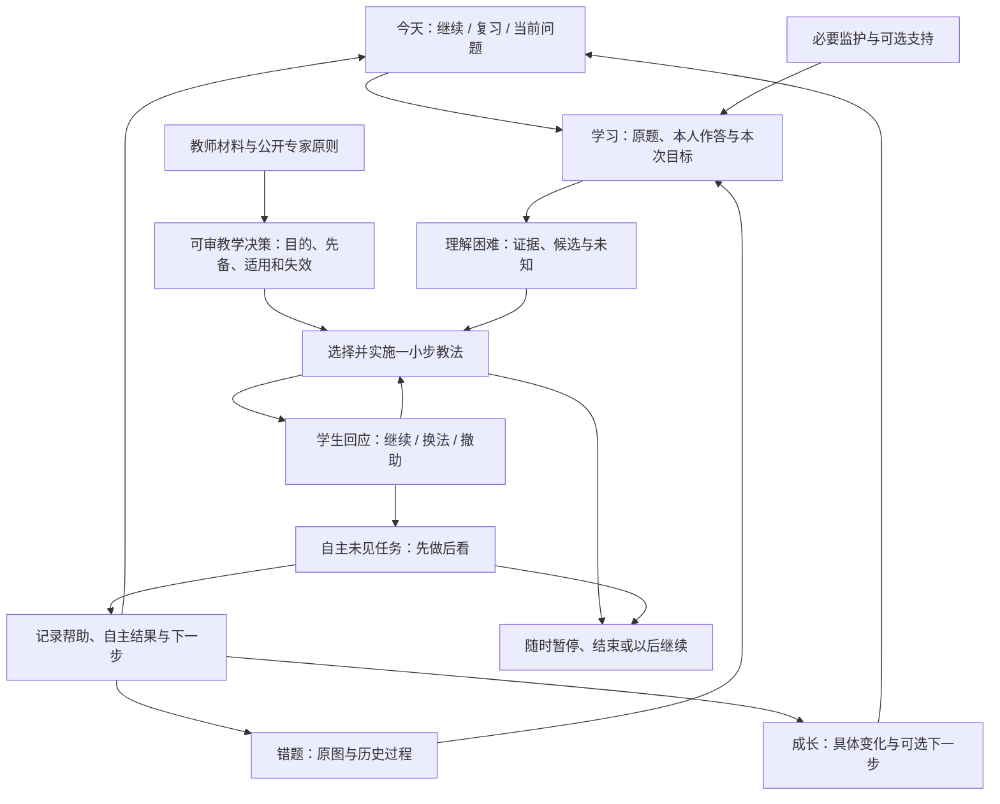

# 19 完整学生产品图

V0.13。表示学生任务与教师经验的关系，不是软件架构。四入口共用同一学习过程，数学案例位于验证层。

```mermaid
flowchart TD
  T[今天：继续 / 复习 / 当前问题] --> L[学习：原题、本人作答与本次目标]
  Q[错题：原图与历史过程] --> L
  L --> D[理解困难：证据、候选与未知]
  E[教师材料与公开专家原则] --> K[可审教学决策：目的、先备、适用和失效]
  K --> A[选择并实施一小步教法]
  D --> A
  A --> R[学生回应：继续 / 换法 / 撤助]
  R --> A
  R --> I[自主未见任务：先做后看]
  I --> M[记录帮助、自主结果与下一步]
  M --> Q
  M --> G[成长：具体变化与可选下一步]
  M --> T
  G --> T
  A --> S[随时暂停、结束或以后继续]
  I --> S
  P[必要监护与可选支持] --> L
```

自主练习从学习进入；复习从今天/错题进入，结果回到成长。没有先备或来源不明时不强行调用经验，多个教法可合理，未知不强制循环。教师辅助供给/审阅，家长辅助监护，不是各自管理主平台。
