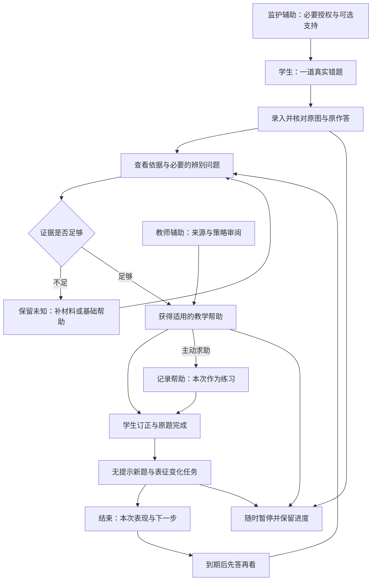

# 19 产品功能结构图

版本状态见[README](README.md)。图表示学生任务和辅助职责，不是软件架构。

```mermaid
flowchart TD
  E[学生：一道真实错题] --> I[录入并核对原图与原作答]
  I --> D[查看依据与必要的辨别问题]
  D --> U{证据是否足够}
  U -->|不足| Q[保留未知：补材料或基础帮助]
  Q --> D
  U -->|足够| H[获得适用的教学帮助]
  T[教师辅助：来源与策略审阅] --> H
  H --> A[学生订正与原题完成]
  A --> N[无提示新题与表征变化任务]
  N --> R[结束：本次表现与下一步]
  R --> L[到期后先答再看]
  L --> D
  H -->|主动求助| P[记录帮助：本次作为练习]
  P --> A
  I --> S[随时暂停并保留进度]
  H --> S
  N --> S
  G[监护辅助：必要授权与可选支持] --> E
```

未知分支不能强制循环，随时可结束/换基础解释。P1周期报告与扩单元不在图的P0主链；数字人、完整家长/教师管理端删除或后置。
