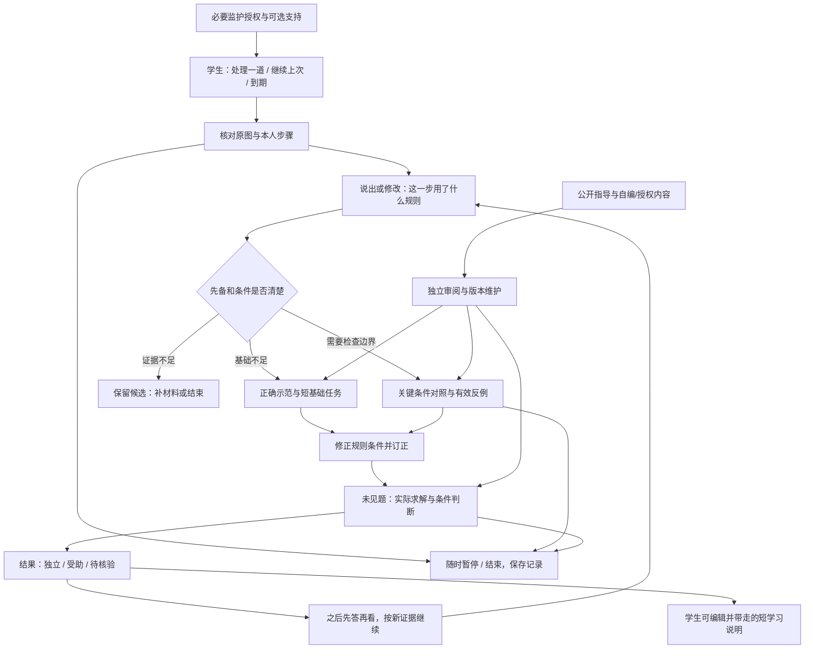

# 19 学生产品结构图

V0.9。图为完整学生服务及内容支撑，不是系统架构。

```mermaid
flowchart TD
  E[学生：处理一道 / 继续上次 / 到期] --> I[核对原图与本人步骤]
  I --> R[说出或修改：这一步用了什么规则]
  R --> P{先备和条件是否清楚}
  P -->|基础不足| B[正确示范与短基础任务]
  P -->|证据不足| U[保留候选：补材料或结束]
  P -->|需要检查边界| C[关键条件对照与有效反例]
  B --> M[修正规则条件并订正]
  C --> M
  M --> N[未见题：实际求解与条件判断]
  N --> O[结果：独立 / 受助 / 待核验]
  O --> L[之后先答再看，按新证据继续]
  L --> R
  T[公开指导与自编/授权内容] --> A[独立审阅与版本维护]
  A --> B
  A --> C
  A --> N
  G[必要监护授权与可选支持] --> E
  I --> S[随时暂停 / 结束，保存记录]
  C --> S
  N --> S
  O --> H[学生可编辑并带走的短学习说明]
```

P0包含两种已学代数机制，共享学生旅程和质量流程；数学条件、先备与任务各自审核。已能独立、只查阅或固定内容足够者走短路径结束，不要求经过全部节点。未知不强制循环。教师辅助内容、家长辅助监护，不建设各自管理主平台。
